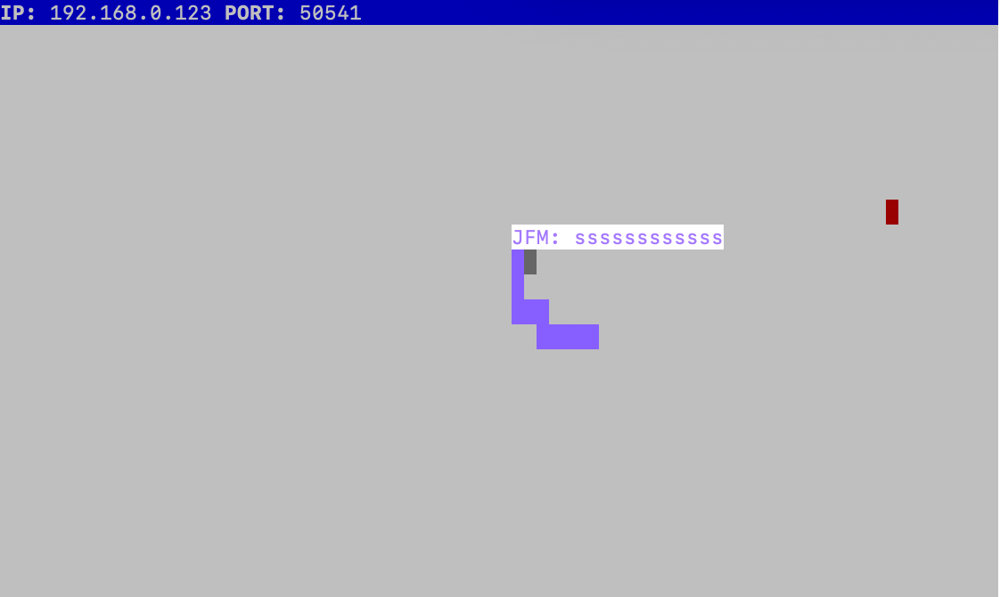

# Snake Client Project

A multiplayer take on the popular video game, Snake, where the plater maneuvers a dot that grows in length as it 'eats' pieces of foods (also dots). The length of the snake's body traces out the path its head took. As the snake lengthens, its body becomes more and more of an obstacle to itself. The goal of the game is to grow the snake as long as possible, without it running into itself, or into any walls.

Before you can run this client, you will need to be running the server side which you can download and install from [here](https://github.com/lighthouse-labs/snek-multiplayer) 

## Final Product

## Getting Started

- Follow steps inside the snek server repo to run the server side
- Run the development snake client using the `node play.js` command.

## Playing the Game

- Use the w,a,s and d keys to move up, left, down and right, respectively
- Eat the red dots onscreen to grow in length
- Avoid crashing into yourself, other player's snakes, and the wall - if you do, it's game over!
- The game will also end if you idle for seven seconds

## Communication

- Every player will have their initials displayed above their snake. Players can choose to send out the following messages using their respective hot keys:
    - g: good game!
    - f: Paying my respects
    - r: ripperoni
    - k: ssssssssssss